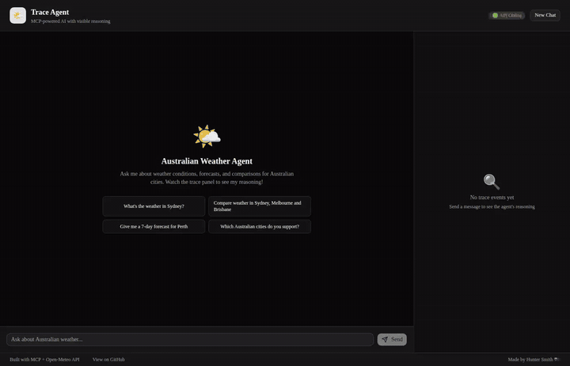
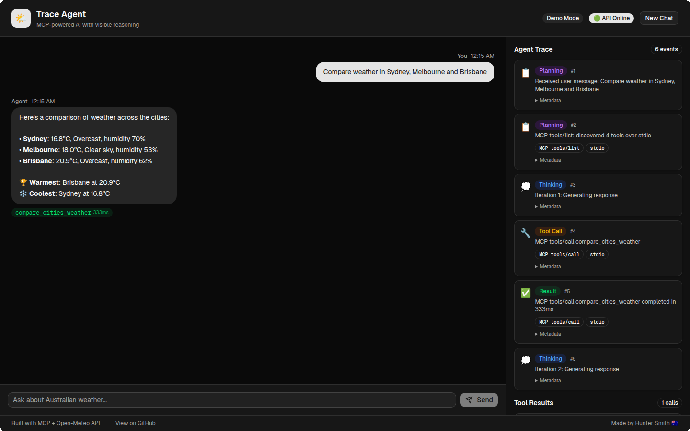
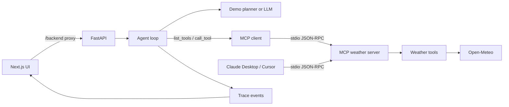

# Trace Agent

[](https://github.com/SmitHunter/trace-agent/actions/workflows/ci.yml)
[](https://github.com/SmitHunter/trace-agent/blob/main/server/pyproject.toml)
[](https://github.com/SmitHunter/trace-agent/blob/main/web/package.json)
[](https://opensource.org/licenses/MIT)

An MCP server plus an MCP-client agent, with a Next.js UI that traces every `tools/list` and `tools/call`. Runs in demo mode with no LLM key. The same weather server is what Claude Desktop and Cursor talk to over stdio.



Demo mode, no LLM key. The expanded Metadata panel is a real `tools/call` payload (`get_current_weather`, stdio, `{"city": "Sydney"}`). Tool Results shows the live Open-Meteo JSON; temperatures change with the weather.



## Problem

Most LLM demos hide the work. For weather questions that need live data, that is the interesting part: which tool ran, with which arguments, whether it failed, and how the answer was assembled.

Trace Agent makes that loop inspectable. Ask a multi-step question about Australian cities. The chat shows the answer. The right-hand panel shows planning, each tool call, timings, and raw JSON from [Open-Meteo](https://open-meteo.com/) (free, no API key).

## What it does

- Answers current-conditions, forecast, and city-comparison questions for 10 Australian cities
- Runs a bounded agent loop: plan → model/demo planner → MCP `tools/list` → MCP `tools/call` → retry transient upstream errors → answer
- Records every MCP call as a trace event the UI can render (method, transport, arguments, timing)
- Speaks MCP over stdio by default, the same transport Claude Desktop and Cursor use
- Falls back to a scripted planner when no LLM key is set, while still calling Open-Meteo for real weather through MCP

## Architecture



The web agent does **not** import the weather functions and call them in-process. On startup, FastAPI opens one long-lived `McpSession`. Each chat turn discovers tools with MCP `tools/list` and invokes them with MCP `tools/call`.

**Transport:** `MCP_TRANSPORT=stdio` (default) spawns `python3 -m mcp_server.server` the same way Cursor and Claude Desktop do. That is the production path, including Docker. `MCP_TRANSPORT=inprocess` attaches the MCP Python client to the in-memory `MCPServer` with the JSON-RPC handshake still enabled (`mode="legacy"`). Pytest uses in-process for speed and still has a dedicated stdio round-trip test.

Streamable HTTP would be a better fit if the MCP server were a separate network service. Here the server is a local stdio process living next to the API, so stdio matches the IDE setup and avoids an extra HTTP listener.

## Quick start (demo mode)

Needs Python 3.11+ and Node.js 20+. No paid keys.

```bash
git clone https://github.com/SmitHunter/trace-agent.git
cd trace-agent

cd server
python3 -m pip install -e ".[dev]"

cd ../web
npm install
```

Terminal 1 — API:

```bash
cd server
DEMO_MODE=true python3 -m uvicorn api.main:app --host 0.0.0.0 --port 8742 --reload
```

Terminal 2 — UI (proxies `/backend` to the API):

```bash
cd web
npm run dev -- -p 3847
```

Open [http://localhost:3847](http://localhost:3847). Try:

- "What's the weather in Sydney?"
- "Compare weather in Sydney, Melbourne and Brisbane"
- "Give me a 7-day forecast for Perth"

The UI should show **Demo Mode**. Tool results still come from live Open-Meteo data.

## Live LLM mode

Set one provider key and turn demo mode off:

```bash
export DEMO_MODE=false
export OPENAI_API_KEY=sk-...          # or ANTHROPIC_API_KEY=sk-ant-...
cd server
python3 -m uvicorn api.main:app --host 0.0.0.0 --port 8742 --reload
```

Keep the web command from above. The planner then uses the model; tool discovery and execution still go through MCP.

## MCP server (Claude Desktop / Cursor)

From `server/`:

```bash
python3 -m mcp_server.server
```

Claude Desktop (`~/Library/Application Support/Claude/claude_desktop_config.json` on macOS):

```json
{
  "mcpServers": {
    "trace-weather": {
      "command": "python3",
      "args": ["-m", "mcp_server.server"],
      "cwd": "/absolute/path/to/trace-agent/server"
    }
  }
}
```

Cursor (workspace `.cursor/mcp.json`):

```json
{
  "mcpServers": {
    "trace-weather": {
      "command": "python3",
      "args": ["-m", "mcp_server.server"],
      "cwd": "${workspaceFolder}/server"
    }
  }
}
```

Example configs live in `mcp-config/`.

### Tools

| Tool | Purpose |
|------|---------|
| `get_current_weather` | Current conditions for one supported city |
| `get_weather_forecast` | Daily forecast, 1–16 days |
| `compare_cities_weather` | Side-by-side current weather, max 5 cities |
| `list_available_cities` | Supported city names |

Supported cities: Adelaide, Brisbane, Canberra, Darwin, Gold Coast, Hobart, Melbourne, Newcastle, Perth, Sydney.

## Example trace

Asking "What's the weather in Sydney?" in demo mode produces a trace like this (timings vary):

```
planning   Received user message: What's the weather in Sydney?
planning   MCP tools/list: discovered 4 tools over stdio
thinking   Iteration 1: Generating response
tool_call  MCP tools/call get_current_weather  { "city": "Sydney" }
tool_result MCP tools/call get_current_weather completed
thinking   Iteration 2: Generating response
```

The trace panel labels those events with an **MCP** badge and the transport (`stdio` or `inprocess`).

The tool result is live Open-Meteo JSON (fields only; values change):

```json
{
  "city": "Sydney",
  "temperature_celsius": 24.2,
  "conditions": "Clear sky",
  "is_daytime": true
}
```

## Tests and checks

```bash
# Python
cd server
python3 -m ruff check .
python3 -m ruff format --check .
python3 -m mypy agent mcp_server api
MCP_TRANSPORT=inprocess python3 -m pytest -v --tb=short

# Web
cd web
npm run lint
npm run typecheck
npm run build
```

GitHub Actions runs the same commands plus a Docker image build.

Dev-dependency audit notes: [SECURITY.md](SECURITY.md).

## Docker

```bash
docker compose up --build
```

Then open [http://localhost:3847](http://localhost:3847). The container starts the API on 8742 and the UI on 3847. The browser talks to `/backend` on the UI origin; Next.js proxies to the API.

To use a real model in Docker, pass `DEMO_MODE=false` and your key in `docker-compose.yml` or the environment. Do not commit keys.

## Design decisions

- **Open-Meteo, not a paid weather API.** The demo has to run for a hiring manager with no account.
- **One MCP server, two clients.** The web agent, Claude Desktop, and Cursor all speak MCP to `mcp_server.server`. Weather logic lives in `mcp_server/tools.py` so the server has a single implementation.
- **Stdio by default.** Same JSON-RPC transport as the IDE configs in `mcp-config/`. In-process is a test shortcut, not a second tool runtime.
- **Demo planner, live tools.** Scripted tool *selection* so the UI works without a model bill. The weather payload still arrives through MCP `tools/call` from Open-Meteo.
- **Retries only on upstream failures.** Unknown cities and bad arguments fail once. HTTP/JSON problems from Open-Meteo retry.
- **Same-origin proxy.** Avoids baking `localhost` into a production frontend bundle and avoids `CORS *` + credentials.
- **Guardrails are limits, not a jailbreak filter.** Input size, tool fan-out, and conversation length are enforced. Naive regex “ignore previous instructions” filters were removed; they block ordinary English and are not a security control.

## Limitations

- Demo mode only recognizes a small set of question shapes. Unrecognized prompts get a help message instead of tools.
- Sessions live in process memory (capped at 100). Restarting the API drops history.
- The demo planner is still scripted. MCP is real; the model is not, unless you set a provider key.
- City lookup is a fixed Australian list, not a geocoder.
- Guardrails do not make the live-LLM path safe to expose unauthenticated on the public internet.

## Project layout

```
trace-agent/
├── server/                 Python: MCP server, agent, FastAPI, tests
├── web/                    Next.js UI
├── mcp-config/             Example IDE MCP configs
├── docs/demo-trace.gif     Demo-mode GIF: ask, trace, expanded JSON
├── docs/demo.png           Screenshot of a real demo-mode run
├── docs/compare.png        City comparison with tool trace
├── SECURITY.md             Dev-dependency audit notes
├── Dockerfile
├── docker-compose.yml
└── .github/workflows/ci.yml
```

## License

MIT. See [LICENSE](LICENSE).

---
Built by **Hunter Smith**, AI Engineer, Melbourne · [GitHub](https://github.com/SmitHunter) · [LinkedIn](https://www.linkedin.com/in/hunter-sm/)
